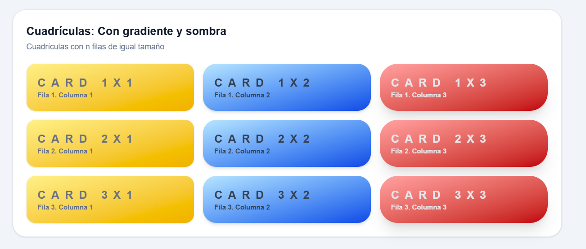
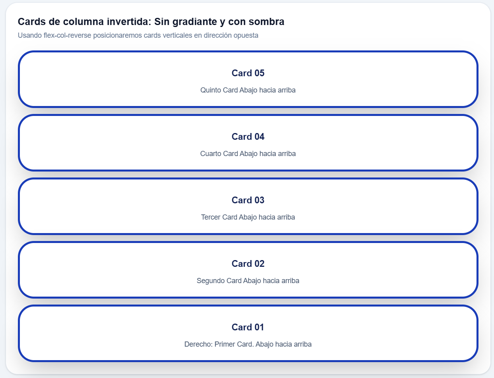
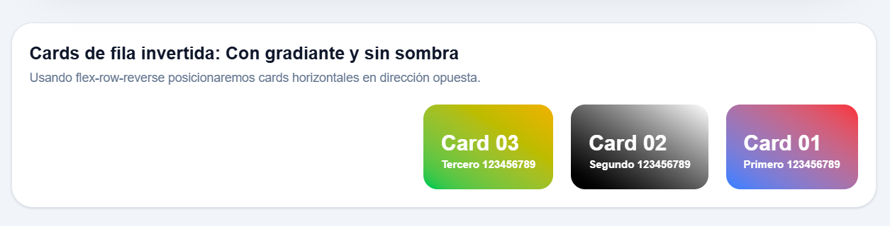
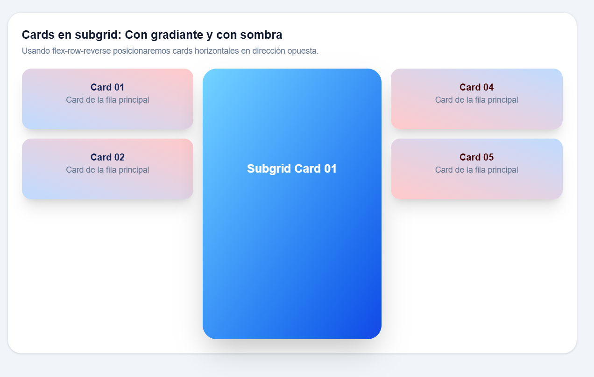

# 04-estilos-layout-tailwind-práctica

Cuadrículas: Se hace una cuadrícula de cards, con un total de 9 cards. Al ingresar los cards, se hacen de arriba hacia abajo,
con un máximo de tres, después del ingresar el cuarto, automáticamente se crea en el lado derecho de las cards creadas,
nuevamente de arriba hacia abajo

Filas invertidas: En este caso usamos flex-col-reverse. A medida que insertemos cards, estos se ordenarán de abajo hacia arriba. Se hizo sin gradiante, pero con bordes y sombras grandes

Columnas invertidas: Es similar al anterior, en este caso, cuando ingresemos cards se hará de derecha hacia la izquierda. Se uso un gradiante usando distintos colores, además de una sombra moderada

Subgrid: En este caso usamos una cuadrícula, usando grid. Pero implementamos un subgrid que ocupa 4 filas. Usamos grid-rows-subgrid, que, Usa las mismas filas del grid padre. 

